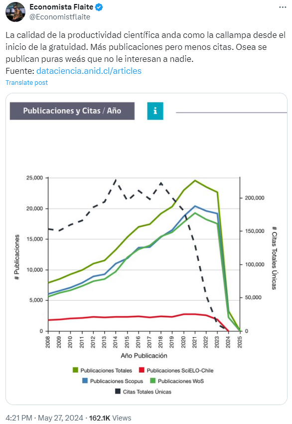

class: front


```{r eval=FALSE, include=FALSE}
# Correr esto para que funcione el infinite moonreader, el root folder debe ser static para si dirigir solo "bajndo" en directorios hacia el bib y otros

xaringan::inf_mr('/static/docpres/02_bases/2mlmbases.Rmd')

o en RStudio:
  - abrir desde carpeta root del proyecto
  - Addins-> infinite moon reader
```


```{r setup, include=FALSE, cache = FALSE}
require("knitr")
options(htmltools.dir.version = FALSE)
pacman::p_load(RefManageR)
# bib <- ReadBib("../../bib/electivomultinivel.bib", check = FALSE)
opts_chunk$set(warning=FALSE,
             message=FALSE,
             echo=FALSE,
             cache = FALSE, fig.width=7, fig.height=5.2)
pacman::p_load(flipbookr, tidyverse)
```


```{r xaringanExtra, include=FALSE}
xaringanExtra::use_xaringan_extra(c("tile_view", "animate_css"))
xaringanExtra::use_scribble()

```

<!---
Para correr en ATOM
- open terminal, abrir R (simplemente, R y enter)
- rmarkdown::render('static/docpres/07_interacciones/7interacciones.Rmd', 'xaringan::moon_reader')

About macros.js: permite escalar las imágenes como [scale 50%](path to image), hay si que grabar ese archivo js en el directorio.
--->

.pull-left[
# Metodología I
## **Kevin Carrasco**
## Magister en Ciencias Sociales FACSO - UChile
## 1er Sem 2024
## [.green[metod1-mcs.netlify.com]](https://metod1-mcs.netlify.com)
] 
    

.pull-right[
.right[
<br>
## .yellow[Sesión 6: Visualización de datos]


]

]

---

layout: true
class: animated, fadeIn


---
class: inverse, bottom, right, animated, slideInRight


# .red[Sesión 6]
<br>

Repaso sesión anterior

Visualización de datos

<br>
<br>
<br>
<br>
---
class: inverse, bottom, right


# .red[Sesión 6]
<br>

.yellow[Repaso sesión anterior]

Visualización de datos
<br>
<br>
<br>
<br>
---
## Medidas de tendencia Central

* **Moda**: valor que ocurre más frecuentemente

--

* **Mediana**: valor medio de la distribución ordenada. Si N es par, entonces es el promedio de los valores medios

--
* **Media** o promedio aritmético: suma de los valores dividido por el total de casos

---
## Medidas de tendencia Central

### Dispersión:

* **Varianza**: promedio de la suma de las diferencias del promedio al cuadrado

.center[]

---

.center[]

---

.center[]
---

.center[]

---

* **Desviación Estándar**:
  - Raiz Cuadrada de la varianza.

  - Expresada  en la mismas unidades que los puntajes de la escala original

---
class: middle, center

# Más sobre datos, variables y varianza en:

##-  [Moore: 1.Comprensión de los datos (1-54)](https://multivariada.netlify.app/docs/lecturas/moore_comprensiondelosdatos.pdf)

---
class: inverse, bottom, right


# .red[Sesión 6]
<br>

Repaso sesión anterior

.yellow[Visualización de datos]
<br>
<br>
<br>
<br>

---

## Visualización de datos

La visualización de datos refiere a la forma que utilizamos para conocer y comunicar mediciones y resultados de análisis.

--

Cumple tres objetivos principales:
  * Exploración: Conocer descriptivos básicos o asociaciones entre variables
  
  * Modelamiento: Comparar estimaciones, determinar diferencias o explicaciones

  * Comunicación: presentar resultados y atraer audiencias

---
## Visualización de datos

La mejor visualización de datos es la que no requiere un esfuerzo para ser comprendida.

Se debe evitar saturar con información. Todo lo que se visualiza debe servir para explicar lo que queremos.

Para comparar tablas o gráficos se deben utilizar las mismas escalas de medición y los mismos límites de los ejes.

---
## Tipos de tablas y tipos de gráficos

Importancia de buenos gráficos


---
## Tipos de tablas y tipos de gráficos

Importancia de buenos gráficos


---
### Tipos de tablas y tipos de gráficos

.center[

]

---
.center[

]

---
## Tipos de tablas y tipos de gráficos

* Descriptivos según tipo de variable

.small[
|             	| Categórica                      	| Continua                  | Categ.(y)/Categ.(x)                    	  | Cont.(y)/Categ.(x)                              |
|-------------	|---------------------------------	|-------------------------	|------------------------------------------------	|------------------------------------------	|
| **Ejemplo** 	| **Estatus Ocupacional**          	| **Ingreso**                       	| **Estatus Ocupacional (Y) / Género (X)**       | **Ingreso (Y) / Género (X)**     |
| Tabla       	| Frecuencias / porcentajes         | $\bar{X}$/sd ... o recodificar en categorías | Tabla de Contingencia  | Clasificar Y                                    |
| Gráfico     	| Barras                          	| Histograma / boxplot      | Gráfico de barras condicionado            | Histograma, box plot condicionado             	|
]

---
## Tipos de tablas y tipos de gráficos

.small[
Ejemplo tabla de descriptiva:
]


```{r echo=FALSE}
load(url("https://github.com/cursos-metodos-facso/metod1-MCS/raw/main/files/data/latinobarometro_proc.RData"))
```
.small[
```{r}
sjmisc::descr(dplyr::select(proc_data, edad, sexo, educacion, conf_inst),
      show = c("label", "n", "range", "md", "mean", "sd")) %>%
      kable(.,"markdown")
```
]

---

## Tabla de contingencia: frecuencia absoluta

```{r}
sjPlot::sjt.xtab(proc_data$sexo, proc_data$conf_gob)
```

---

## Tabla de contingencia: porcentaje solo filas

```{r}
sjPlot::sjt.xtab(proc_data$sexo, proc_data$conf_gob,
         show.row.prc = TRUE, #solo fila
         show.summary = FALSE) 
```

---

## Tabla de contingencia: porcentaje solo columnas

```{r}
sjPlot::sjt.xtab(proc_data$sexo, proc_data$conf_gob,
         show.cell.prc = TRUE, #fila y columna
         show.summary = FALSE) 
```

---

## Tabla de contingencia: porcentaje columnas y filas

```{r}
sjPlot::sjt.xtab(proc_data$sexo, proc_data$conf_gob,
         show.col.prc=TRUE, #solo columna
         show.summary=FALSE) 
```

---
Ejemplo gráfico de barras:

.center[


]

---
Ejemplo gráfico de barras condicionado:

.center[

]

---
Ejemplo Histograma:

.center[

]

---

.small[Ejemplo gráfico de cajas:]

.center[


]
---

... pero ojo! esto también avanza muy rápido

---
## Tipos de tablas y tipos de gráficos

Ejemplo gráfico alternativo de [twitter](https://twitter.com/RosanaFerrero/status/1635536429957758977):


---

class: front

.pull-left[
# Metodología I
## **Kevin Carrasco**
## Magister en Ciencias Sociales FACSO - UChile
## 1er Sem 2024
## [.green[metod1-mcs.netlify.com]](https://metod1-mcs.netlify.com)
] 
    

.pull-right[
.right[
<br>
## .yellow[Sesión 6: Visualización de datos]


]

]
